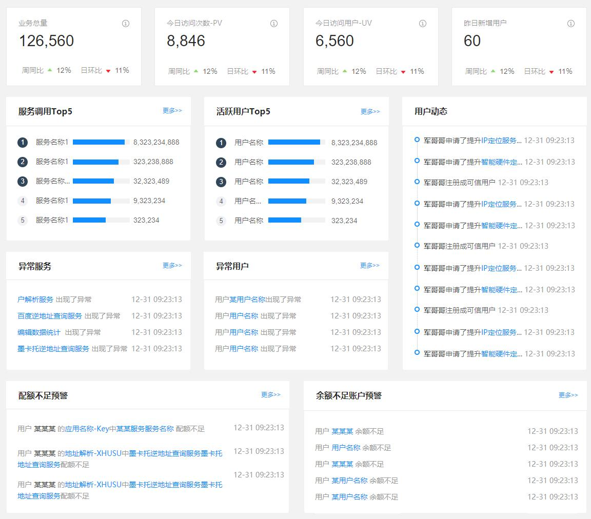
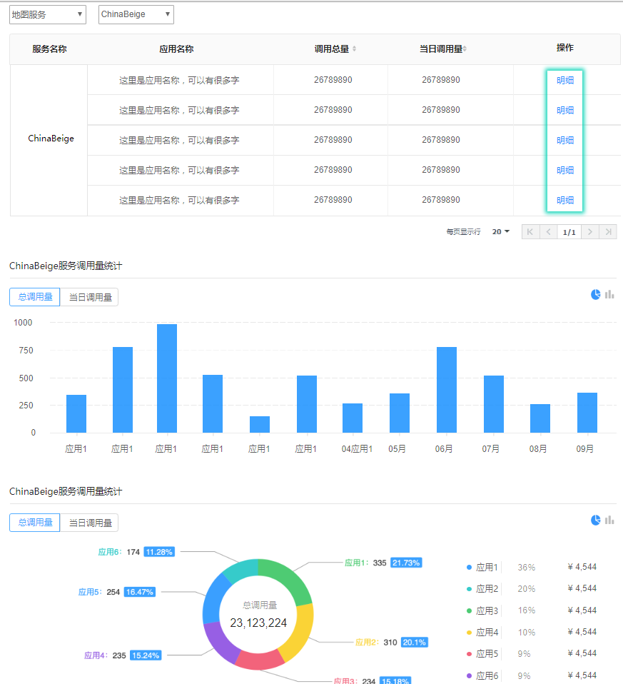
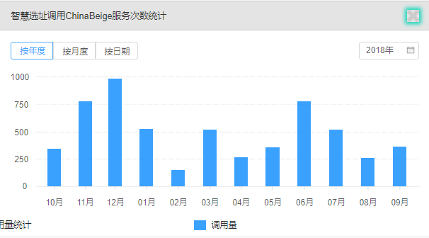
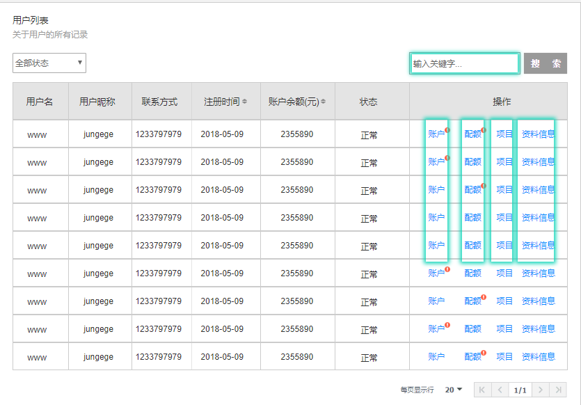

## 一、系统管理

### 1. 数据总览



#### 1.1 统计

* 接口：`/center/menudata/getAccessOverview`

* 请求方式：`GET`

* 请求参数：

* 返回结果：

  ``` 
[{
            type: 'tv',
            name: '业务总量',
            value: 0,
            dayPercent: 0,
            weekPercent:0
        },
        {
            type: 'pv',
            name: '今日访问次数-PV',
            value: 0,
            dayPercent: 0,
            weekPercent:0
        }, {
            type: 'uv',
            name: '今日访问用户-UV',
            value: 0,
            dayPercent: 0,
            weekPercent:0
        }, {
            type: 'av',
            name: '昨日新增用户',
            value: 0,
            dayPercent: 0,
            weekPercent:0
        }]
  
  ```

#### 1.2 服务调用TOP5

- 接口：`/center/menudata/getServiceTopList`

- 请求方式：`GET`

- 请求参数：

- 返回结果：

  ```
  "data":[
              {
                  "serviceName":"伊春市地图资源",
                  "value":8323234888
              },
              {
                  "serviceName":"合肥市地图资源",
                  "value":1323234
              },
              {
                  "serviceName":"基础地图服务",
                  "value":832347
              },
              {
                  "serviceName":"大庆地图服务",
                  "value":14520
              },
              {
                  "serviceName":"宁波地图服务9",
                  "value":123
              }
          ]
  ```

#### 1.3 活跃用户TOP5

- 接口：`/center/menudata/getUserTopList`

- 请求方式：`GET`

- 请求参数：

- 返回结果：

  ```json
  "data":[
              {
                  "userName":"zpp",
                  "value":8323234888
              },
              {
                  "userName":"123",
                  "value":13232345
              },
              {
                  "userName":"456",
                  "value":8323475
              },
              {
                  "userName":"789",
                  "value":1452050
              },
              {
                  "userName":"hhh",
                  "value":1232450
              }
          ]
  ```

#### 1.4 异常服务

- 接口：`/center/menudata/getServiceAbnormalList`

- 请求方式：`GET`

- 请求参数：

- 返回结果：

  ```json
  [
      {
          "serviceName":"合肥市地图资源",
          "info":"出现了异常",
          "createTime":"2018-12-02 12:00:00"
      },
      {
          "serviceName":"基础地图服务",
          "info":"出现了异常",
          "createTime":"2018-12-03 12:00:00"
      }
  ]
  ```


#### 1.5 异常用户

- 接口：`/center/menudata/getUserAbnormalList`

- 请求方式：`GET`

- 请求参数：

- 返回结果：

  ```json
  [
       {
           "userName":"zpp",
           "info":"出现了异常",
           "createTime":"2018-12-01 12:00:00"
       },
      {
          "userName":"李磊",
          "info":"出现了异常",
          "createTime":"2018-12-02 12:00:00"
      }
  ]
  ```


#### 1.6 配额不足预警

- 接口：`/center/menudata/getInsufficientQuotaList`

- 请求方式：`GET`

- 请求参数：

- 返回结果：

  ```json
  [
      {
          "userName":"莉莉",
          "appName":"应用场景",
          "serviceName":"大庆地图服务",
          "info":"出现了异常",
          "createTime":"2018-12-07 12:12:00"
      },
      {
          "userName":"吉姆",
          "appName":"应用场景",
          "serviceName":"合肥市地图资源",
          "info":"出现了异常",
          "createTime":"2018-12-07 12:12:00"
      }
  ]
  ```


#### 1.7 余额不足账户预警

- 接口：`/center/menudata/getInsufficientFundsList`

- 请求方式：`GET`

- 请求参数：

- 返回结果：

  ```json
  [
      {
          "userName":"莉莉",
          "info":"出现了异常",
          "createTime":"2018-12-07 12:12:00"
      },
      {
          "userName":"吉姆",
          "info":"出现了异常",
          "createTime":"2018-12-07 12:12:00"
      }
  ]
  ```
#### 1.8 用户动态

- 接口：`/center/menudata/getUserCallLog`

- 请求方式：`GET`

- 请求参数：

- 返回结果：

  ```json
  [
      "data": [
			{
				"server": "调用了es楼盘边界查询服务",
				"time": "2018-11-22 18:32:55",
				"username": "智慧选址1"
			},
			{
				"server": "调用了ChinaGray服务",
				"time": "2018-11-22 18:32:54",
				"username": "智慧选址2"
			},
			{
				"server": "调用了ChinaGray服务",
				"time": "2018-11-22 18:32:54",
				"username": "智慧选址3"
			},
			{
				"server": "调用了ChinaGray服务",
				"time": "2018-11-22 18:32:54",
				"username": "智慧选址4"
			},
			{
				"server": "调用了ChinaGray服务",
				"time": "2018-11-22 18:32:54",
				"username": "智慧选址5"
			}
  ]
  ```


### 2. 服务管理

#### 2.1 服务详情




#### 2.1.1 服务详情明细




## 二、 用户管理



#### 2.1 配额

#### 2.2 项目

#### 2.3 资料信息


***


## 三、任务分配

| 分类                | 明细                                                         | 开发时间 | 负责人 | 备注（完成标准） |
| ------------------- | ------------------------------------------------------------ | -------- | ------ | ---------------- |
| 系统管理 - 数据总览 | 统计<br>服务调用Top5<br>活跃用户Top5<br>异常服务<br>异常用户<br>配额不足预警<br>余额不足账户预警 |          | 张培培 | UI界面及接口联调 |
| 系统管理 - 服务管理 | 服务调用详情及明细                                           |          | 雷勇   | UI界面及接口联调 |
| 用户管理 - 操作     | 配额<br>项目<br>资料信息                                     |          | 雷勇   | UI界面及接口联调 |


