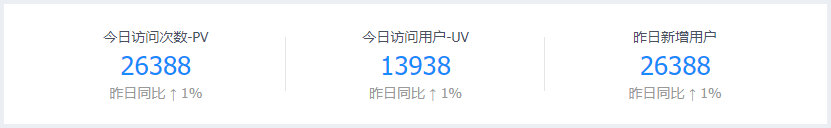
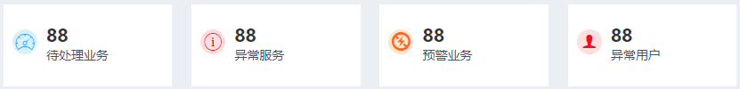
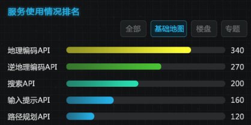
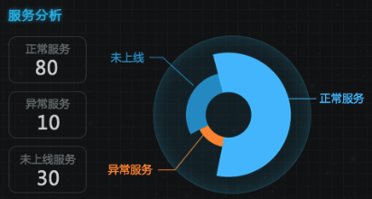

## 数据总览接口

### 一、流量分析

* 请求地址：`/api/...`

* 请求方式：`POST`

* 请求参数：

  ```json
  {
      "type": 1,       // 类型: 1，访问次数；2,访问人数
      "starttime":"",   // 开始时间
      "endtime":""     // 结束时间
  }
  ```

* 返回结果：

  ```json
  {
      "data": [120, 132, 101, 134, 90, 230, 210]
  }
  ```

  

### 二、业务分析

* 请求地址：`/api/...`

* 请求方式：`POST`

* 请求参数： 

  ```json
  {
      "starttime":"",   // 开始时间
      "endtime":""     // 结束时间
  }
  ```

* 返回结果：

  （同 **流量分析**）


### 三、用户分析

- 请求地址：`/api/...`
- 请求方式：`POST`

- 请求参数： 

  ```json
  {
      "starttime":"",   // 开始时间
      "endtime":""     // 结束时间
  }
  ```

- 返回结果：

  ```json
  {
      "data":[
          { "name": "用户总数", "value": [1,2,3,4,5] },
          { "name": "新增用户", "value": [1,2,3,4,5] }
      ]
  }
  ```

  

### 四、访问统计



* 请求地址：`/api/...`

* 请求方式：`POST`

* 请求参数：（无）

* 返回结果：

  ```json
  {
      "data": [
          { "type": "pv", "value": "26388", "percent": "10" },  // 今日访问次数-PV
          { "type": "uv", "value": "16388", "percent": "8" },  // 今日访问用户-UV
          { "type": "av", "value": "26388", "percent": "-10" },  // 昨日新增用户
      ]
  }
  ```

  

### 五、异常统计



- 请求地址：`/api/...`

- 请求方式：`POST`

- 请求参数：（无）

- 返回结果：

  ```json
  {
      "data": [
          { "type": "wait", "value": 88 },            // 待处理业务
          { "type": "error-server", "value": 88 },    // 异常服务
          { "type": "warning", "value": 88 },         // 预警业务
          { "type": "error-user", "value": 88 },      // 异常用户
      ]
  }
  ```


### 六、用户动态

- 请求地址：`/api/...`
- 请求方式：`POST`
- 请求参数：（无）
- 返回结果：

```json
{
    "data": [
        { "time": "...", "username": "张三", "server": "IP定位配额" },
        { "time": "...", "username": "李四", "server": "IP定位配额" }
    ]
}
```


### 七、服务使用情况排名



- 请求地址：`/api/...`

- 请求方式：`POST`

- 请求参数：

  ```json
  {
      "type": "0"           // 0，全部；1，基础地图；2，楼盘；3，专题
  }
  ```

- 返回结果：

  ```json
  {
      "data": [
          { "name": "地图编码API", "value": 340 },
          { "name": "地图编码API2", "value": 340 },
          { "name": "地图编码API3", "value": 340 },
          { "name": "地图编码API4", "value": 340 },
          { "name": "地图编码API5", "value": 140 }
      ]
  }
  ```

  

### 八、服务分析



- 请求地址：`/api/...`

- 请求方式：`POST`

- 请求参数：（无）

- 返回结果：

  ```json
  {
      "data": [
          { "name": "正常服务", "value": 200 },
          { "name": "未上线", "value": 100 },
          { "name": "异常服务", "value": 30 }
      ]
  }
  ```

  